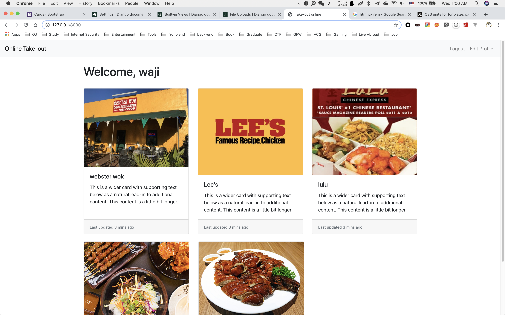
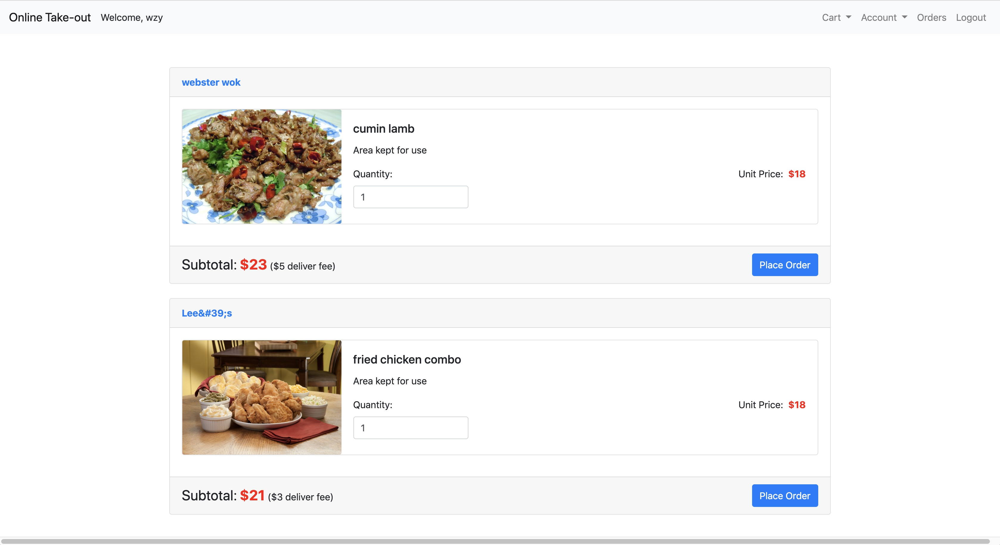
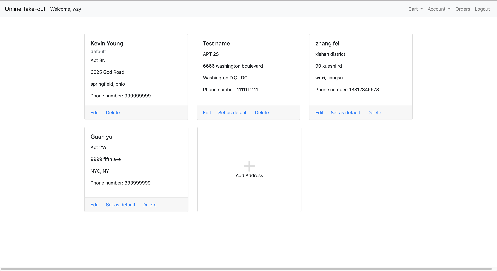
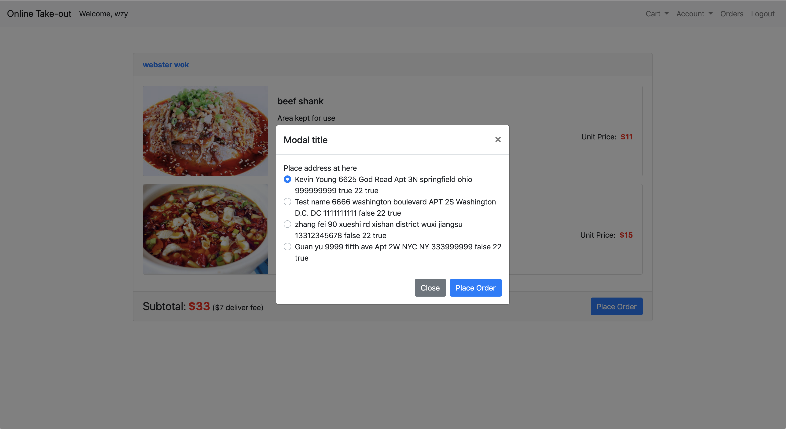
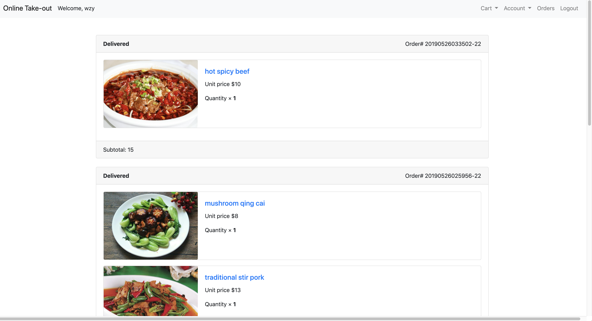
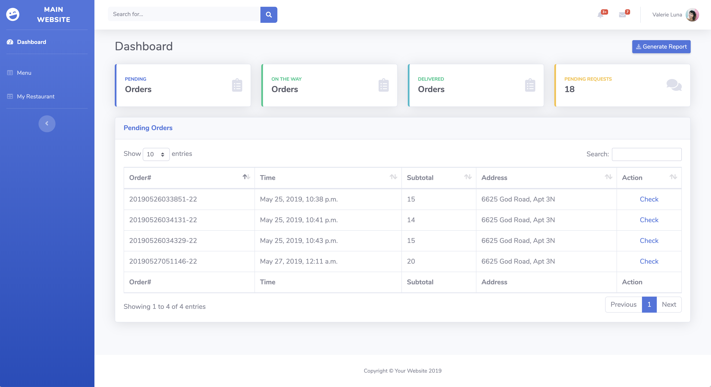
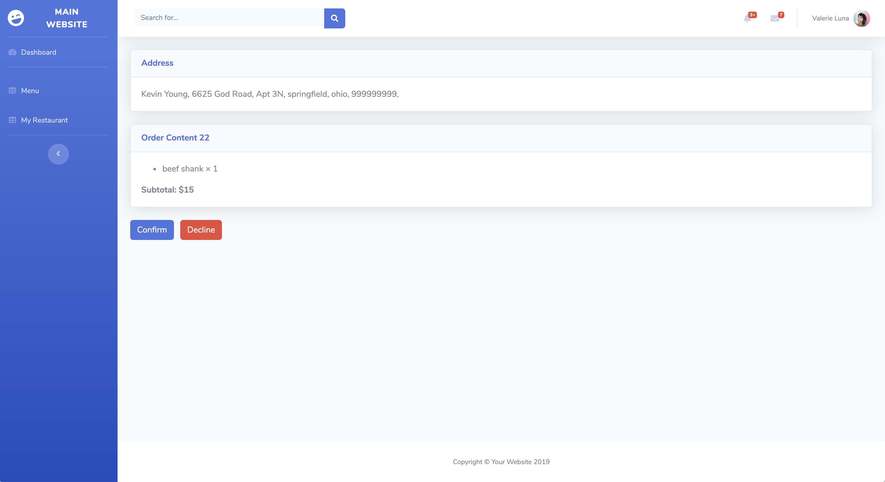
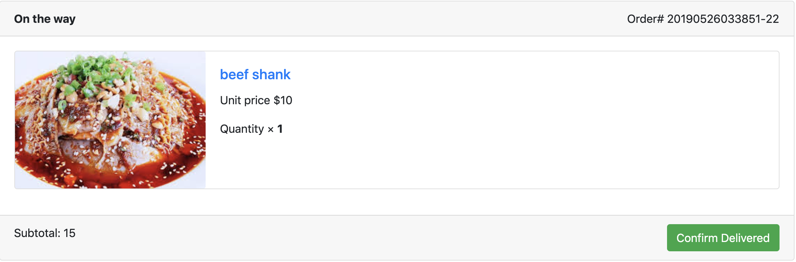
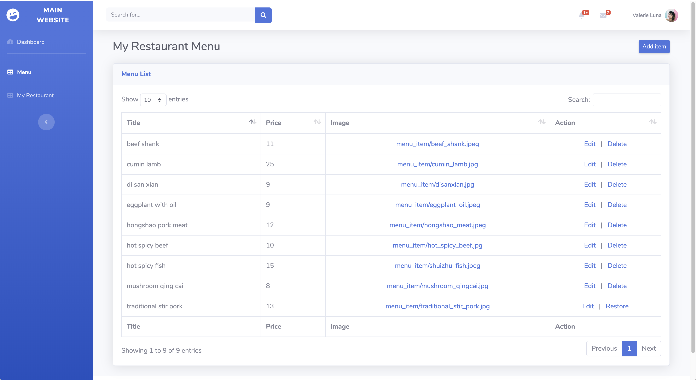
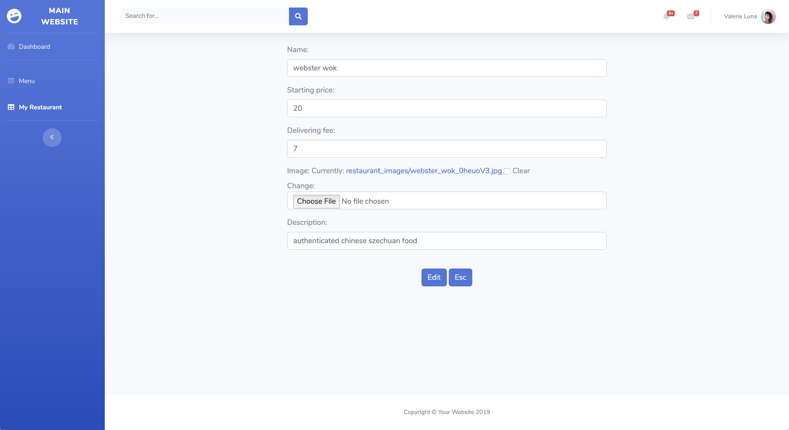

# onlineOrder

This is a django-based web application written by me, which is a online food order website. It's already been deployed on my server and can be accessed. Here is the [link](http://takeout.majorkevin.xyz).

The back-end is implemented with python django framework. The front-end is based on bootstrap, while I use both jQuery and vue.js to operate on front-end.

It has three main apps, which are user auth, customer and restaurant dashboard.

## user auth

The user auth app is mainly in charge of the authentication activity such as login, logout, register, edit profile and so on.

Django provides built-in user authentication system and many other built-in generic views which can be used to deal with these common control logics. So it would be a waste if I don't use them.

To customize my own user class, I substitute a custom User model which inherit fro mthe AbstractBaseUser, and give it a Manager so that it can integrate with the django user authentication system. With my own customized User model, I have to write my own UserChangeForm and UserCreationForm so I can enjoy the benefit provided by django.

## customer

This is the core of my project since the goal of this website is to serve as a website for users to order food online. Here is the index page of the website.

Here I use the jumbotron in bootrap to show the logo as well as top 2 sellers of all the restaurants. You can browse the menu of a restaurant, add the food to cart, change the cart and place orders. The cart information is stored in both client-side browser's cookies and server-side database column to achieve persistent cart data. In this case, logout or changing devices won't affect the user experience since they cart would be sychronized by specific control logic.

In the cart, you can see all the foods that have been added to the cart and change the quantities. After you make your decision, you can place the order.

Apart from the above core functionality, you can manage your addresses and your placed orders.

Please set a default address or select a address before placing order, otherwise your order couldn't be processes.

After placing your orders, you can find them in the order management page which has all the orders that you have order by time. Right now, I just make it 5 orders every page without any filtering option.

If you hold a restaurant, you can manage your restaurant by click the Account -> My Restaurant, which I would introduce in the dashboard app. If you are not having a restaurant, you can create a restaurant and from then on you restaurant would also be shown on the website. In other words, every customer can also be a seller at the same time.

## dashboard

Since you have a restaurant, there would be a portal in Account tab which would lead you to the back-end dashboard of your restaurant where you can see all the statistics, including pending orders, confirmed orders and delivered orders.

Every order is a pending order after it's been placed by the customer. The pending orders need to be either confirmed or declined by the seller for some reasons. If the seller choose to confirm the order, then it means they are working on it and would deliver it to the customer. The delivering status of the order is just a simulation and there will be no real food that would be delivered to you, haha.

As a customer, you can confirm that your order has been delivered to you to complete the whole life cycle of a order. The time a customer confirms the delivery of his order, the order status becomes delivered and can be seen in the dashboard.

Besides this, a seller can also manage their posted food by editing or deleting them and he can also modify the information of his restaurant including the name, staring price, delivering fee, description of the restaurant and the logo of the restaurant.

# Others

I'm still working on the readme page because there are so much to describe. Feel free to check out the link to try the website if you want to know in depth about the project.